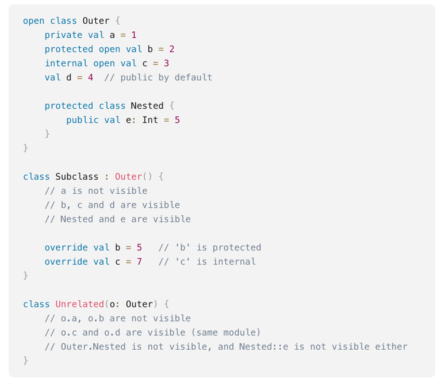

## Hermetyzacja i kontrola dostępu
1. Dostępne modyfikatory dostępu:
   - domyślny modyfikator __public__
   - __private__ -> widoczność tylko w obrębie klasy
   - __protected__ -> tak jak private + klasy dziedziczące (nadpisanie pozostawia ustawioną wcześniej widoczność, jeśli nie zadeklarujemy innego zachowania)
   - __internal__ -> widoczność w obrębie modułu

2. Konstruktory
   - domyślnie widoczność publiczna (wszędzie, gdzie klasa jest dostępna)
   - jeśli chcemy określić wprost widoczność konstruktora, musimy użyć słowa kluczowego __constructor__
