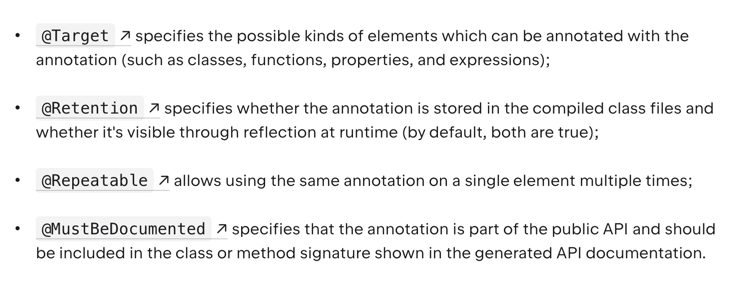
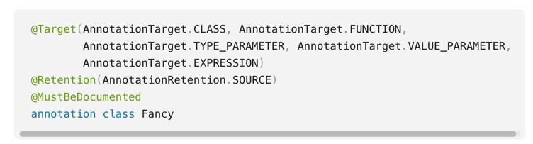

## Adnotacje
Dzięki nim umieszczamy metadane w kodzie

### Podstawowe parametery adnotacji:

### Konstruktory w adnotacjach
1. Nie wszystkie typy parametrów są dopuszczone:
   - odpowiedniki prymitywów
   - Stringi
   - Klasy
   - Enumy
   - Inne adnotacje
   - Tablice (dla powyższych typów)
   
### Kompatybilność z javą
1. Adnotacje z Kotlina są w pełni kompatybilne z javą

### ***
PRZYKŁAD:
1. Adnotacja wraz z jej odczytaniem
### ***
