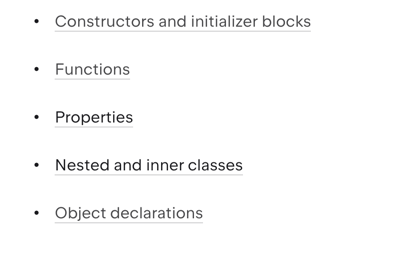

## Klasy i interfejsy

### Deklaracja klasy
1. Tworzymy za pomocą słówka class
2. Najprostsza klasa -> `class MyClass`

### Konstruktory
1. Jeden główny konstruktor + jeden lub wiele dodatkowych
2. Domyślny konstruktor nie może mieć kodu
3. Kod inicjalizujący możemy umieścić w dowolnej ilości bloków `init{}`
4. Jeśli nie zadeklarujemy konstruktora, domyślnie tworzy się konstruktor bezargumentowy
5. Zawsze trzeba się odwołać do konstruktora głównego
6. Możemy zmienić widoczność głównego konstruktora, ale musimy użyć wtedy wprost słowa kluczowego `constructor`

### ***
PRZYKŁAD:
1. Wiele konstruktorów oraz bloków inicjalizujących w klasie
### ***

### Tworzenie instancji klasy
1. Kotlin nie posiada słowa kluczowego `new`

### Zawartość klasy

### Klasy abstrakcyjne
1. Deklarujemy je za pomocą słówka `abstract`

### Companion objects
1. Singleton tworzony na potrzeby klasy, w której jest deklarowany
2. Zaspokaja potrzeby realizowane przez static, ale w bardziej obiektowy sposób

### ***
PRZYKŁAD:
1. Companion object w klasie
### ***

### Interfejsy
1. Definiujemy wykorzystując słówko kluczowe `interface`
2. Możemy deklarować metody abstrakcyjne, jak również z domyślną implementacją
3. Implementujemy poprzez znak `:`
4. Musimy zaimplementować wszystkie abstrakcyjne metody
5. Możemy też deklarować properties w ramach interfejsów (zarówno abstrakcyjne, jak również z implementacją)
6. Interfejsy mogą implementować inne interfejsy
7. Implementacja z wykorzystaniem słówka kluczowego `override`

### ***
ZADANIE:
1. Utworzyć interfejs `Borrowable` z metodą abstrakcyjną `borrow()` oraz `return()` i z domyślną metodą `canBeBorrowed()` + property borrowed
2. Utworzyć klasę `Film`, która będzie implementowała ten interfejs
### ***
