## Kolekcje

### Wprowadzenie (kotlin.collections)
1. List -> kolekcja z indeksami, gdzie istotna jest pozycja elementu, może zawierać duplikaty (domyślnie implementowany przez ArrayList)
2. Set -> kolekcja, gdzie pozycja nie jest istotna (zbiór), nie ma duplikatów (domyślnie implementowany przez LinkedHashSet -> znany pierwszy i ostatni element)
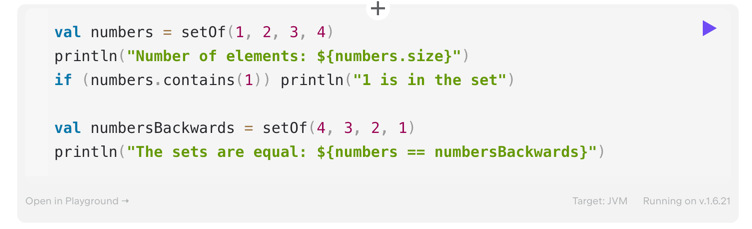
3. Map -> pary z kluczami i wartościami (klucze są unikalne)
4. Niemutowalność przede wszystkim

### ***
PRZYKŁAD 1: Nulle w domyślnych implementacjach kolekcji
### ***

### Tworzenie kolekcji
1. Podstawowe funkcje do tworzenia kolekcji: `listOf<>()`, `setOf()<>`, `mutableListOf<>()`, `mutableSetOf<>()`, `mapOf()`, `mutableMapOf()`
2. Można wykorzystać buildery
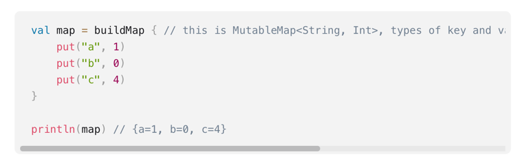
3. Mamy też dostępne metody do tworzenia pustych kolekcji `emptyList()`, `emptySet()`, `emptyMap()`
4. Żeby pominąć domyślne klasy kolekcji trzeba użyć konkretnych konstruktorów, klas, które chcemy wykorzystać
5. Kopiowanie -> dostępne metody pozwalają na płytką kopię (pozostają referencje do dotychczasowej zawartości)

### ***
PRZYKŁAD 2: Zmiana obiektów w jednej kolekcji wpływa na zmianę w kolekcji skopiowanej
### ***

### ***
PRZYKŁAD 3: Dwie zmienne mają referencję do tej samej kolekcji
### ***

### Iterator
1. Standardowy wzorzec wykorzystywany w javie do iterowania po kolekcjach
2. Standardowo kolekcje implementują interfejs `Iterable<>`, który ma funkcję `iterator()`
3. Iterator po utworzeniu wskazuje na pierwszy element i poprzez wywołanie `next()` idzie do następnego -> nie ma możliwości powrotu (do ponownych operacji tworzy się nowy iterator)
4. Iteratorów używamy w pętlach while (wprost) oraz for (pośrednio), mamy też możliwość wykorzystać metodę funkcyjną forEach (również jest częścią interfejsu Iterable)

### ***
PRZYKŁAD 4: Iterowanie po kolekcji za pomocą `while`, `for`, `forEach`
### ***

5. Dla list mam specjalny iterator `ListIterator` który pozwala na iterowanie w dwie strony
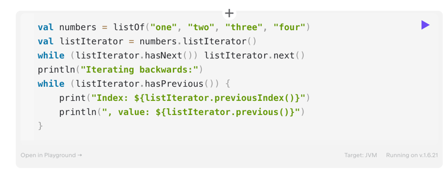
6. Dla kolekcji mutowalnych mamy `MutableIterator`, który pozwala na mutowanie listy podczas iteracji (set, add, remove)

### ***
PRZYKŁAD 5: Mutwanie kolekcji podczas iteracji
### ***

### ***
ZADANIE 1: Usunąć z wykorzystaniem iteratora wszystkie filmy, które zostały nakręcone przed 1990 rokiem
### ***

### Range
1. Zakres to zamknięty obustronnie przedział
2. W kotlinie łatwo można tworzyć zakresy (`1 rangeTo(10)`, `1..10`, `10 downTo 1`, `1..10 step 2`, `10 downTo 1 step 2`) wartości oraz iterować po nich
3. Można sprawdzać też za pomocą `in` czy coś jest w danym zakresie

### ***
ZADANIE 2: Zbudować zakres od 1990 do 2000 i sprawdzić, czy film znajduje się w zakresie
### ***

4. Range/ Progressions jako sposób na pozbycie się tradycyjnej pętli for w javie
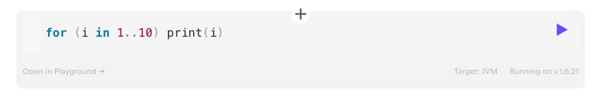

### Sequence
1. Przypominają trochę strumienie z javy 8+. Pozwalają na wykonanie operacji w najbardziej leniwy możliwy sposób
Bez sekwencji:
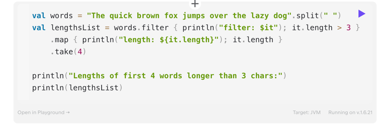
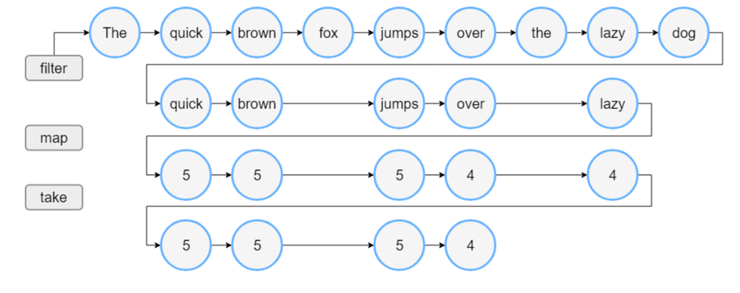

Z wykorzystaniem sekwencji:
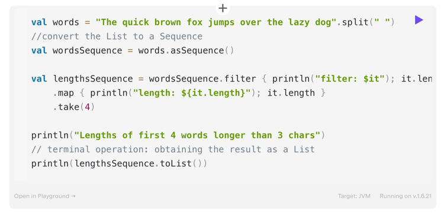
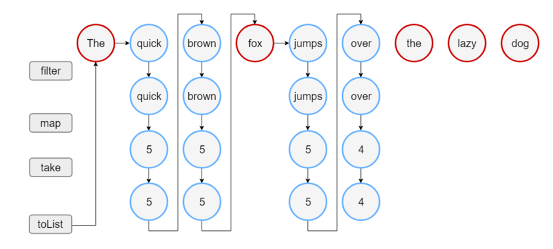
https://kotlinlang.org/docs/sequences.html#sequence-processing-example

3. Kolekcje można zmieniać w sekwencje poprzez wywołanie `toSequence()`

### Podstawowe operacje
1. Ważne! W zależności czy mamy mutowalną kolekcję, czy niemutowalną pewne operacje mogą zmieniać kolekcję/ zwracać nową (np. `sort()`)

#### Transformacje
1. Map -> zmienia elementy kolekcji
2. Zip -> wiąże elementy dwóch kolekcji
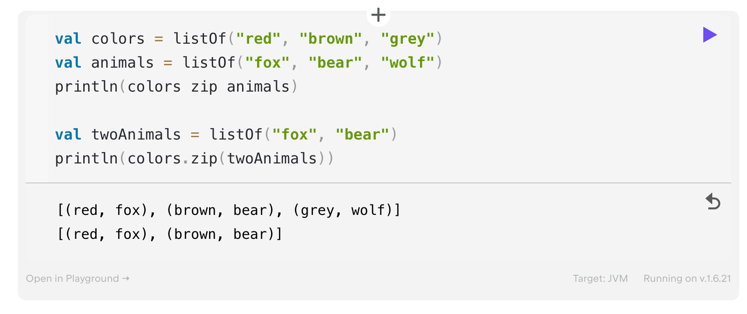
3. Associate -> tworzy mapę

### ***
ZADANIE 3: Zbudować mapę z podanej listy, gdzie kluczem będzie wartość po lewej stronie `-` a wartością będzie prawa strona
### ***

4. Flatten -> pozwala "wypłaszczyć" kolekcję kolekcji
5. FlatMap -> pozwala na procesowanie zaszytych kolekcji z wynikiem jako jedna lista 
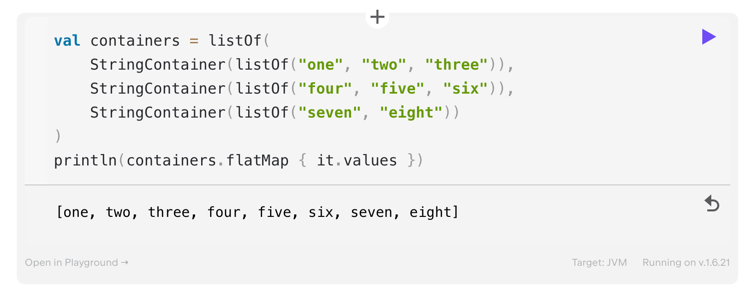

6. JoinToString -> pozwala połączyć elementy kolekcji do jednego stringa

### ***
ZADANIE 4: 
1. Połączyć wszystkie filmy z kolekcji filmsRaw do jednego stringa
2. Filmy mają być oddzielone ` || `
3. Zbudowany string powinien się zaczynać od `Films collection: `
### ***

#### Filtrowanie
1. Umożliwia pozostawienie wartości spełniających predykat
2. Używamy operatora `filter` oraz pochodnych `filterNot` `filterNotNull`
3. Mamy też możliwość sprawdzenia predykatu na całej kolekcji `any()` `none()` `all()`

### ***
ZADANIE 5:
1. Zostawić na liście films tylko filmy, które mają tytuł zbudowany z więcej niż jednego słowa
### ***

### ***
ZADANIE 6:
1. Sprawdzić, czy jakikolwiek film z listy films został nakręcony po danym roku
### ***

#### Dodawanie i odejmowanie elementów z kolekcji
1. Można używać operatorów `+` `-`lub metod `plus()` i `minus()`
2. Użycie operatorów zwraca nową listę z dodanym elementem

#### Grupowanie
1. Można grupować elementy z listy i tworzyć mapę za pomocą operatora `groupBy`
2. Jest również dostępne wykonanie określonych transformacji przy grupowaniu

#### Dzielenie na grupy
1. Można dzielić kolekcje na kawałki
2. Wykorzystujemy do tego metodę `chunked()`
3. Możemy również dzielić kolekcje na okna za pomocą `windowed()`

### ***
PRZYKŁAD 6: Różnica pomiędzy chunked i windowed
### ***

#### Sortowanie
1. Wykorzystanie metody `sorted()` oraz `sortedDescending()` -> kolekcja musi zawierać elementy, które implementują interfejs `Comparable`
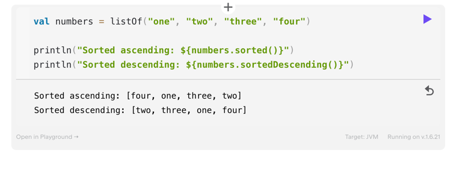

2. Dla elementów, które nie implementują interfejsu `Comparable` mamy metodę `sortedBy()` i `sortedByDescending()`
3. Żeby dostać kolekcję w odwrotnej kolejności, można wykorzystać funkcję `reversed()`

### ***
ZADANIE 7:
1. Posortować listę films na podstawie roku produkcji -> od najnowszego do najstarszego
2. Odwrócić tę kolekcję, tak, żeby najstarszy film był na początku
### ***
