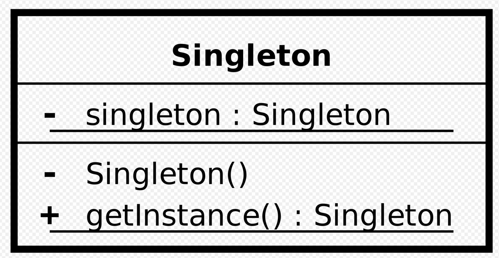

## object / companion object
1. sposoby na prostą implementację wzorca singleton

### object
1. Deklarujemy za pomocą słówka `object`
2. Używamy jak statycznych metod

### companion object
1. Spełnia podobną funkcję do object, ale jest deklarowany wewnątrz klasy
2. Dostęp do deklarowanych pól poprzez odwołanie do nazwy klasy
3. Mogą implementować interfejsy, podobnie jak klasy `object`

#### Różnicą pomiędzy deklaracjami object i companion object jest moment inicjalizacji
- `object` jest leniwy
- `companion object` ładuje się razem z klasą, gdzie jest umieszczony

### *** 
ZADANIE: Przygotować klasę `Film` z prywatnym konstruktorem, polami `title`, `genre` i `year` oraz ze statyczną metodą faktorującą `create()`, która będzie walidowała, czy rok jest powyżej 1900
### ***
