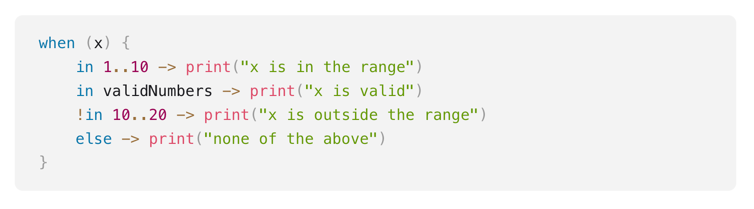
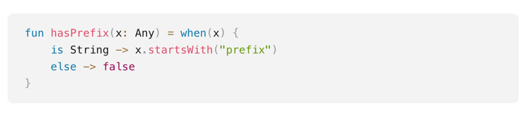

## Instrukcje sterujące

### if-else
1. If zwraca wartość
2. Brak operatora ternary
3. W przypadku przypisania wartości zwracanej przez if do zmiennej branch else jest obowiązkowy

### when
1. Podobny do switch
2. Może być użyty jako wyrażenie zwracające wartość
3. W przypadku przypisania wartości zwracanej przez when branch else jest obowiązkowy/ wszystkie przypadki są wyczerpane
4. Przypadki, które chcemy obsłużyć tak samo, oddzielamy przecinkiem
5. Można używać operatora in lub is

6. Możemy stosować when zamiennie z if-else

###  *** ZADANIE: Convert if-else to when (ConvertIfElseToWhen.kt) *** 
