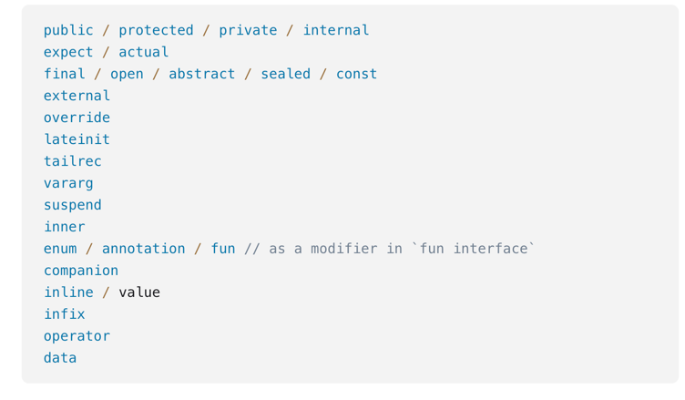
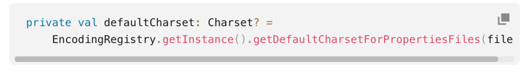
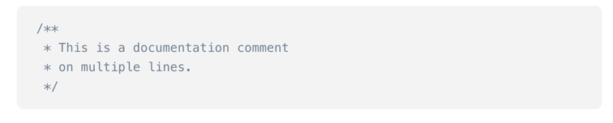
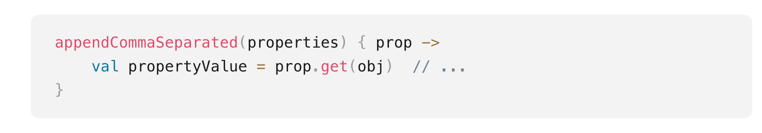

## Konwencje

1. Nazwy plików
    - zawierające jedną klasę
    - zawierające wiele klas/ tylko top level
    - unikamy nieznaczących/ bardzo ogólnych nazw
2. Organizacja klas
    - kolejność (properties, constructors, methods, companions)
    - umieszczamy powiązane składniki blisko siebie
    - organizacja implementacji interfejsów (kolejność jak w interfejsie)
3. Nazwy klas, metod i pakietów
    - pakiety (małe litery bez podkreślników -> raczej nie używamy nazw wieloliterowych)
    - nazwy klas zaczynają się z dużej litery i dalej camelCase
    - nazwy metod
    - nazwy metod testowych
    - nazwy stałych
    - wykorzystanie podkreślników dla prywatnych właściwości
    - wybieranie znaczących nazw
4. Formatowanie
    - indentacja
    - jeśli parametry metody nie mieszczą się w jednej linii stosujemy linię dla parametru
5. Kolejność słów kluczowych (https://kotlinlang.org/docs/coding-conventions.html#modifiers-order)
   
6. Adnotacje
    - umieszczamy przed modyfikatorami
    - adnotacje bez argumentów mogą być umieszczone obok siebie
    - opcja umieszczenia adnotacji bezargumentowej w tej samej linii co adnotowana wartość

********************

7. Metody
    - jeśli parametry metody nie mieszczą się w jednej linii, umieszczamy każdy osobno (podobnie jak w klasach)
8. Właściwości klasy
    - dla krótkich konstrukcji typu read-only umieszczamy wszystko w jednej linii
    - kiedy inicjalizujemy wartość dajemy nową linię po operatorze przypisania
      
9. Indentacja
10. Wywołanie metod
    - Jeśli jest dużo argumentów, grupujemy je tematycznie i umieszczamy te grupy w oddzielnych liniach
    - łańcuszki wywołań -> każde kolejne wywołanie metody umieszczamy w osobnej linii (wraz z kropką)
11. Wyrażenia lambda
    - umieszczamy w nawiasach klamrowych po nazwie metody
12. Trailing comma (https://kotlinlang.org/docs/coding-conventions.html#trailing-commas)
    - umieszczamy przecinek na końcu kolejnych linii w liście parametrów, włączenie z ostatnią linią
      -> upraszcza to śledzenie zmian w kolejnych wersjach, ułatwia zmianę kolejności oraz dodawanie nowych elementów i ułatwia generowanie kodu
13. Komentarze (javadoc)
    - krótkie umieszczamy w jednej linii
    - długie umieszczamy w ten sposób:
    
14. Unikamy zbędnych konstrukcji
    - zwracany typ Unit
    - średnik
    - nawiasy klamrowe przy prostych string templates
15. Funkcje vs właściwości
    - wyglądają bardzo podobnie w określonych sytuacjach
    - kryteria wyboru właściwości
      - brak rzucania wyjątku
      - niski koszt obliczenia
      - zwracana wartość nie zmieni się jeśli stan obiektu się nie zmieni
16. Mniejsza potrzeba stosowania wzorca Builder (przekazywanie nazwanych argumentów)
17. Wyrażenia lambda

