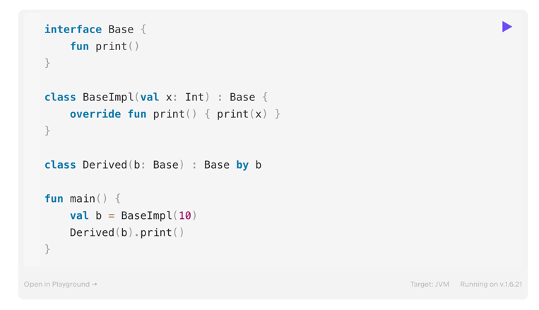

## Delegacja
Pattern, który jest alternatywą dla dziedziczenia

1. Przechowywany wewnętrznie obiekt będzie realizował metody kierowane do `Derived`
2. Jeśli jednak nadpiszemy daną metodę wtedy nasza wersja zostanie wykorzystana
3. Ważne!!! -> jeśli nadpiszemy property, z którego korzysta delegat to i tak zostanie wykorzystane to w implementacji delegata

### ***
ZADANIE: 
1. Utworzyć interfejs bazowy `Playable` z metodą `play()` i property `name: String`. 
2. Utworzyć implementację `Film` - play niech wypisuje `playing $name` i jako name ustawi `film`
3. Utworzyć klasę `Comedy` z delegatem `Playable`. Niech nadpisze property name i podstawi `comedy`
4. Napisać metodę main, która jako delegata podstawi `Film` i wywoła metodę `play()`
### ***
