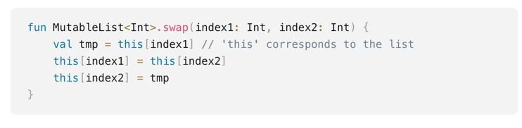
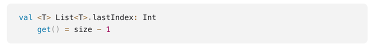
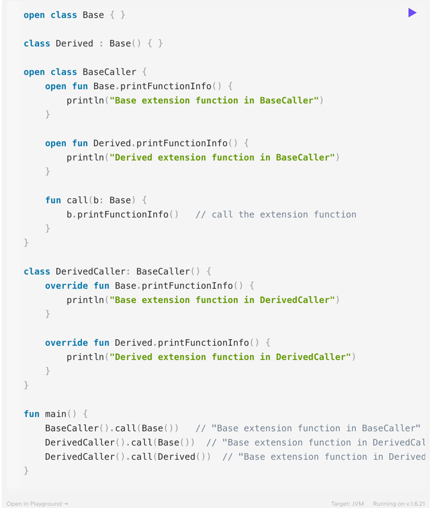

## Extensions
Umożliwienie rozszerzenia bibliotek bez konieczności dziedziczenia lub użycia wzorców projektowych

### Funkcje
1. Musimy zastosować się do określonych warunków, żeby "dodać" funkcję do klasy z wykorzystywanej biblioteki

2. Rozszerzenia nie zmieniają w żaden sposób klas, które rozszerzamy
3. Jeśli mamy w danej klasie funkcję, która nazywa się tak samo jak rozszerzenie i ma te same argumenty, zawsze wygrywa członek klasy

### ***
PRZYKŁAD: Dodanie rozszerzenia do klasy
### ***

### Properties
1. Musimy określić gettery/ settery, jeśli chcemy zadeklarować extension property

### Companion Objects
1. Można jak najbardziej rozszerzać takie klasy

### Dziedziczenie
1. Możemy nadpisywać extension functions w ramach hierarchii dziedziczenia

### ***
ZADANIE: Napisać rozszerzenie klasy String -> dodanie metody - `encodeWithCesarCipher()` -> https://pl.wikipedia.org/wiki/Szyfr_Cezara
### ***
