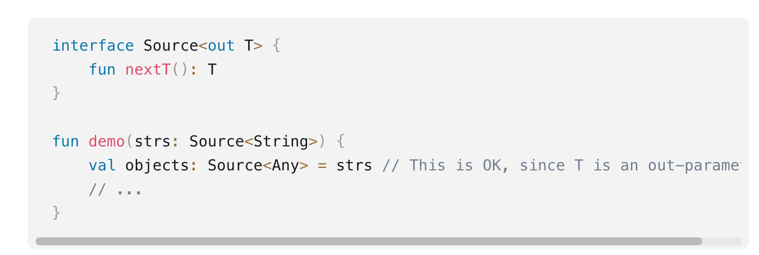
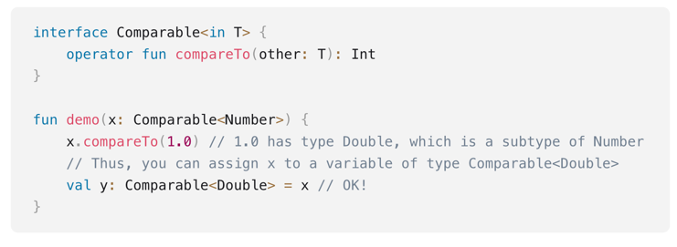
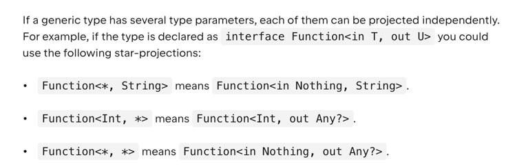

## Typy generyczne

### Typy generyczne w javie
1. Wprowadzają dużo komplikacji
2. Typy powiązane dziedziczeniem nie mogą być w prosty sposób stosowane zamiennie

### Podstawowe informacje
1. Typy generyczne mogą być deklarowane podobnie jak w javie
2. Mogą być pomijane przy użyciu, jeśli kompilator jest w stanie "odgadnąć" właściwy typ
3. Nie mamy wildcardów

### Declaration-site variance 
1. Jeśli wiemy, że typ generyczny jest tylko zwracany z metod, a nie jest konsumowany możemy zastosować deklarację `<out T>`. 

2. Mamy również `<in T>` gdzie określamy, że parametr jest używany w parametrach wejściowych metod

### *
1. Działa trochę jak raw types w javie, ale w bardziej bezpieczny sposób

### Funkcje generyczne
1. Możemy deklarować generyczne parametry
2. Wywołanie podobnie jak przy tworzeniu klas
3. Również można omijać określenie typu generycznego, jeśli może być łatwo wydedukowany przez kompilator

### Deklarowanie ograniczenia
1. Możemy określić "upper bound" -> analogicznie do extends w javie (np. `MyClass<T : Comparable<T>>`)
2. W takiej sytuacji nie możemy podstawić czegoś, co nie spełnia zadanej relacji

### Wymazywanie typów
1. Typy generyczne są sprawdzane w czasie kompilacji
2. W runtime są one wymazywane
3. Podobnie dzieje się w javie, gdzie typy generyczne również zapewniają bezpieczeństwo tylko podczas pisania kodu/ kompilacji
