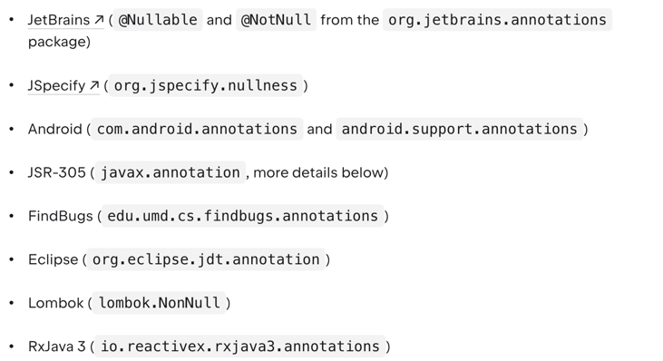
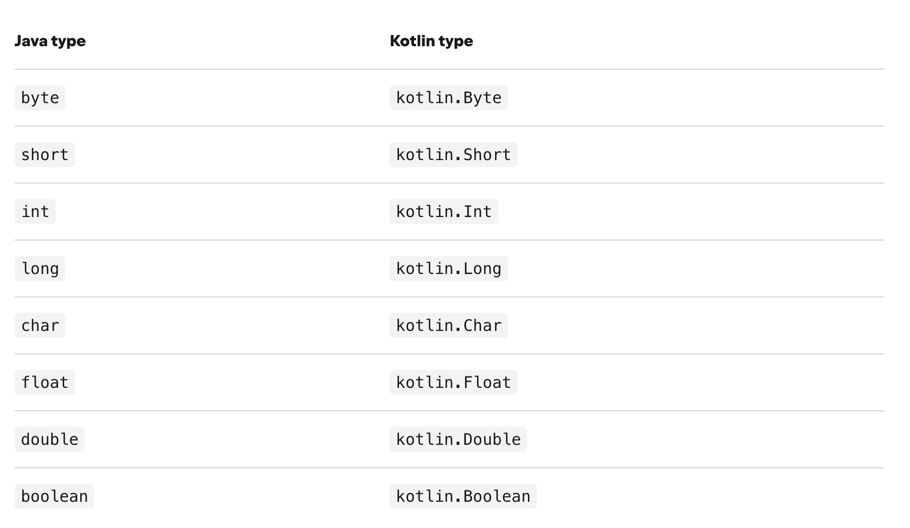
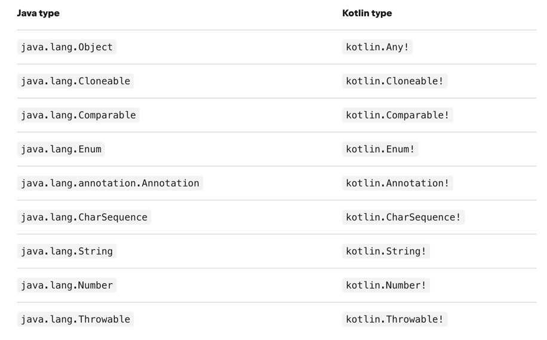
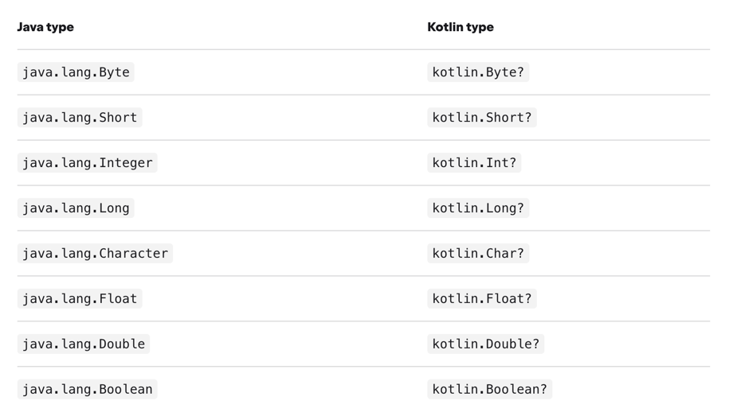

## Interoperacyjność z javą

### Co Kotlin ma, czego nie ma w javie
1. Null safety
2. Typy prymitywne są przykryte
3. Tablice są inwariantne (niezmienniki) -> nie można podstawić tablicy stringów pod tablicę Any
4. Kotlin ma typy funkcyjne
5. Brak wildcardów w typach generycznych
6. Brak checked exceptions
7. Brak statycznych typów
8. Brak operatora ternary
9. Extension functions
10. String templates
11. Delegates
12. Singleton wbudowany w język
13. Przeciążanie operatorów
14. Data classes
15. Val i var
16. niemutowalne kolekcje jako podstawa
17. coroutines
18. Ranges

### Używanie kodu napisanego w javie
1. Możemy korzystać praktycznie bez większych ograniczeń z kodu napisanego w javie
2. Gettery i settery są widoczne jako properties w Kotlinie (oprócz klas, które mają tylko settery)
3. Metody zwracające Void w javie będą reprezentowane przez metody zwracające Unit
4. Java i Kotlin różnią się częścią słów kluczowych -> w takich przypadkach używa się w kodzie `` (np. method.\`is\`("sth"))
5. Dla kodu javowego są zmniejszone ograniczenia związane z nullowalnością (potencjalne wystąpienie NPE)
6. Kompilator wspiera adnotacje wykorzystywane w javie do określenia nullowalności argumentów (możemy wybrać rodzaj reakcji) - działa też dla generyków

### ***
PRZYKŁAD: Łańcuszki wywołań, a NPE
### ***

#### Mapowanie typów

#### Wyjątki
W Kotlinie wszystkie wyjątki są unchecked -> nie trzeba łapać wyjątków checked zadeklarowanych w javie 

### Używanie w projekcie Javowym kodu napisanego w Kotlinie
1. Gettery i settery są generowane z properties
2. Metody i properties na poziomie pliku są mapowane do statycznych członków klasy nazwanej jak nazwa pliku
3. Możemy zmodyfikować mapowanie klas poprzez użycie adnotacji __@file:JvmName("MyMappedClass")__
4. Możliwość stosowania @JvmField do mapowania pól
5. Możliwość stosowania @JvmStatic do mapowania statycznych pól/ metod

### ***
PRZYKŁAD: Używanie w projekcie Javowym kodu napisanego w Kotlinie
### ***

#### Modyfikatory dostępu
1. private pozostaje private
2. private na poziomie pliku mapuje się do package-private w javie
3. protected pozostaje protected
4. internal mapuje się do public
5. public pozostaje public

#### Rozwiązywanie konfliktów nazw
1. Wykorzystujemy @JvmName

#### Domyślne parametry
1. Podstawowe zachowanie to wygenerowanie metody z wszystkimi argumentami
2. Można zastosować @JvmOverloads, aby wygenerować wszystkie dostępne wersje metody

### ***
PRZYKŁAD: Konstruktor z dużą ilością domyślnych parametrów
### ***

#### Wyjątki
1. W Kotlinie nie ma specjalnej obsługi checked exceptions, więc nie musimy deklarować, że metoda rzuca określony checked exception
2. Żeby wykorzystać taki kod z poziomu javy trzeba użyć w kotlinie adnotacji @Throws

