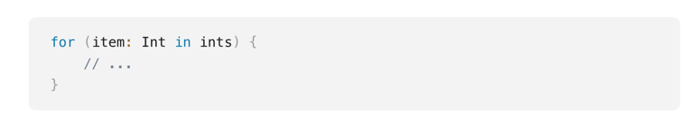
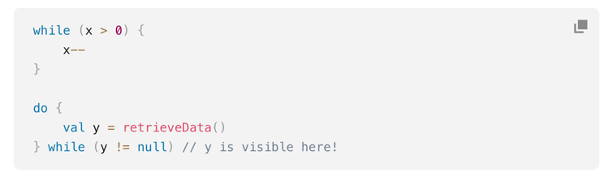
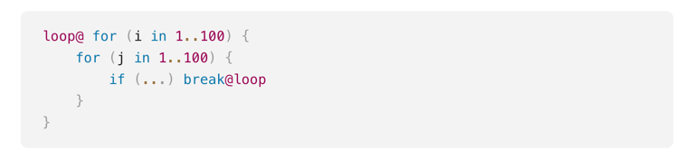

## Pętle

## for

1. Możemy iterować po wszystkim, co daje nam iterator -> odpowiednik foreach
2. Możemy iterować po indeksach -> array.indices

### ***
ZADANIE:
1. Iterate with for loop (ForLoopIterate.kt)
### ***

## while

1. Działa na podobnej zasadzie jak w javie

### ***
ZADANIE:
1. Iterate with while loop (WhileLoopIterate.kt)
### ***

## break i continue
1. break kończy najbliższą pętlę
2. continue przechodzi do następnego kroku najbliższej pętli
3. Można używać labeli w przypadku pętli i łatwo odnieść się do konkretnego miejsca

Więcej informacji -> https://kotlinlang.org/docs/returns.html
