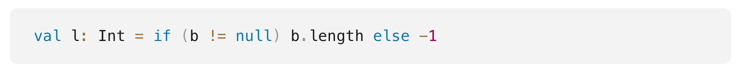
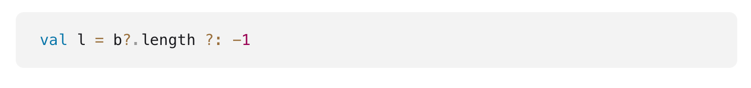

## Typy opcjonalne

### Tony Hoare - billion dolar mistake
I call it my billion-dollar mistake. It was the invention of the null reference in 1965. At that time, I was designing the first comprehensive type system for references in an object oriented language (ALGOL W). My goal was to ensure that all use of references should be absolutely safe, with checking performed automatically by the compiler. But I couldn't resist the temptation to put in a null reference, simply because it was so easy to implement. This has led to innumerable errors, vulnerabilities, and system crashes, which have probably caused a billion dollars of pain and damage in the last forty years. (https://en.wikipedia.org/wiki/Tony_Hoare#Apologies_and_retractions)

### NPE w Kotlinie
1. Wbrew niektórym stwierdzeniom NPE w Kotlinie istnieje, ale trzeba się o niego postarać
    - użyć wprost `!!` - czyli ignorowanie nullowalności
    - rzucenie wprost NPE
    - problemy na etapie inicjalizacji
    - wykorzystanie kodu napisanego w javie

### Jak korzystać z null safety?
1. Dodajemy jako postfix znak `?` (np. `val name: String?` oznacza, że name może być Stringiem, ale również może nie mieć przypisanej wartości)
2. Dalej trzeba zawsze sprawdzić przypadek, kiedy dana wartość będzie nullem. 
3. Dodatkowo kompilator jest w stanie sprawdzić, czy weryfikowaliśmy już ten przypadek (np. `if (name != null) {...tutaj już name będzie traktowane jako nienullowalne}`) - zmienna musi być niemutowalna
4. Można również używać nullowalnych wartości z pomocą `?.` (np. `name?.substring()`) - jeśli name będzie nullem, całe wyrażenie również będzie nullem

### Elvis
       G   __
       \\  ,,)_
        \'-\( /
          \ | ,\
           \|_/\\
           / _ '.D
          / / \ |
         /_\  /_\
        '-    '-

1. `?:`
2. Operator pozwala na obsłużenie przypadku, kiedy wartość wyrażenia będzie nullem

vs.

### Ignorowanie NPE
1. Jeśli chcemy jednak narazić się na NPE używamy `!!`

### Safe cast
1. Możemy wykorzystać operator `?` do bezpiecznego castowania

### ***
ZADANIE: 
1. Zaimplementować metodę `prepareRandomDrink()` w klasie `NullSafety`
2. Jeśli dostaniemy null w metodzie pickValue, zwracamy domyślną wartość (water)
3. Domyślą wartość zapiszmy w `companion object`
### ***
