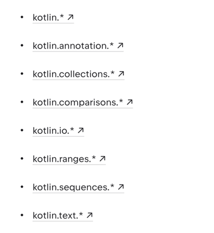
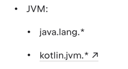

## Wykorzystanie pakietów

### Definiowanie pakietu
1. Deklarujemy pakiet na początku pliku (jeśli nie zawartość będzie w pakiecie default)
2. Klasy są zdefiniowane jako pakiet + nazwa klasy (np. com.example.MyClass)
3. Jeśli mamy funkcje bezpośrednio w pliku są one zdefiniowane jako pakiet + nazwa funkcji (np. com.example.myFunction())

### Domyślnie importowane pakiety

### Importy
1. Import pojedynczej klasy
2. Import całej zawartości pakietu
3. Konflikt nazw
4. Importowanie funkcji, pól i stałych
5. Dostęp do składników pliku (private modifier)

### ***
PRZYKŁAD: Importy w Kotlinie
### ***
