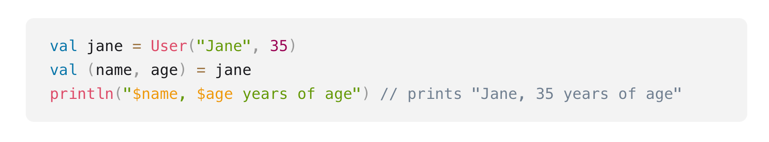
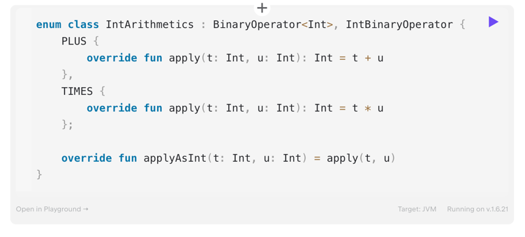

## Special classes

### ***
__ZADANIE__: 
1. Utworzyć w javie klasę Film, która będzie miała pola title, director, genre, year
2. Przygotować implementację metody `toString()`, żeby prezentowała dane w formacie: `[title: My Title, director: Some Director, genre: Some genre, year: 2000]`
3. Przygotować implementację `equals()` (filmy są takie same, jeśli mają wszystkie pola takie same) i `hashCode()`
4. Przygotować implementację metody `copy()`, która pozwoli nam skopiować Film ze zmienionym polem year
### ***

### Data class
1. Specjalne klasy do przechowywania danych
2. Mają implementację -> `equals()/hashCode()`, `toString()`, `copy()` (wykorzystywane są tylko parametry głównego konstruktora)
3. Wymagania dla data class:
   - musi mieć przynajmniej jeden parametr w głównym konstruktorze
   - parametry to val lub var
   - nie może być `abstract`, `open`, `sealed`, albo `inner`
4. Może dziedziczyć
5. Może nadpisać `equals()/hashCode()`, `toString()`
6. Nie może nadpisać `copy()`
7. Można robić destrukturyzację data class

### Sealed class/ interface
1. Deklarowane za pomocą słówka `sealed`
2. Pozwalają na większą kontrolę nad dziedziczeniem
3. Nie mogą po nich dziedziczyć klasy spoza naszej jednostki kompilacji (moduł)
4. Konstruktor `protected` (default) lub `private`

### Nested class/ interface vs inner class
1. Klasa/ interfejs może być częścią innej klasy -> nested
2. Klasę nested możemy opatrzyć dodatkowo słówkiem `inner` -> wtedy ma dostęp do składników zewnętrznej klasy

### ***
PRZYKŁAD:
1. Tworzenie klasy nested oraz inner i prezentacja ich właściwości
### ***

### Enum class
1. Podobna rola jak w przypadku javy
2. Konwencja -> zazwyczaj deklarujemy wartości dużymi literami
3. Mamy dostęp do własności `name` i `ordinal`
4. Można deklarować pola w konstruktorze
5. Można deklarować abstrakcyjne metody
6. Można implementować interfejsy

### ***
ZADANIE:
1. Zaimplementować interfejs Playable w enumie FilmGenre (klasa `FilmGenre.kt`)
2. W ramach każdej wartości enuma mamy wypisać `Playing + nazwa enuma`
### ***

### Inline class
1. Umożliwiają przygotowanie wrappera dla określonej klasy
2. Wykorzystanie ze względów domenowych oraz wydajnościowych
3. Deklarowane za pomocą słówka `value`
4. Muszą mieć jeden property w głównym konstruktorze
5. Mogą mieć funkcje i properties oraz bloki init
6. Mogą dziedziczyć po interfejsach
7. Po kompilacji funkcjonują podobnie do typów takich jak Int -> czasami mogą funkcjonować jak typ wrapowany, a czasami jest używany wprapper
8. Żeby wykorzystywać takie klasy z javy trzeba użyć `@JvmInline`
9. `value class` vs `typealias`

