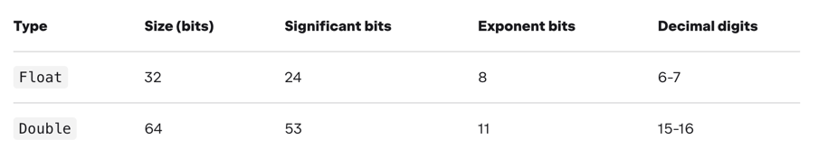

## Typy bazowe

#### Porównywanie obiektów
1. == wskazuje na equals()
2. === porównuje czy dwa obiekty są takie same
3. Jeśli chcemy inne zachowanie operatora == musimy dostarczyć inną implementację metody equals

### ***
PRZYKŁAD:
1. Porównywanie intów (`ComparingInts.kt`)
### ***

### Ważne! -> wszystkie typy w Kotlinie są widoczne jako obiekty (choć nie muszą nimi być)

#### Typy przechowujące wartości całkowite

1. Integer -> Int
    - interferowane wartości liczbowe mieszczące się w zakresie Int przyjmują automatycznie typ Int
2. Long -> może być inicjalizowany poprzez postfix __L__ (np. 5L)
3. Short
4. Byte

### ***
PRZYKŁAD:
1. Tworzenie typów całkowitych (`Types.kt`)
### ***

#### Typy przechowujące wartości zmiennoprzecinkowe

1. Double - domyślnie interferowany
2. Float -> może być inicjalizowany poprzez postfix __F__ lub __f__  (np. 1.5F)

Dla większej czytelności można stosować podkreślniki

### ***
PRZYKŁAD:
1. Tworzenie typów zmiennoprzecinkowych (`Types.kt`)
### ***

#### Przechowywanie liczb w pamięci
1. Numery są przechowywane jako typy prymitywne
   - Int -> int
   - Double -> double
   - Long -> long
   - Float -> float
   - Byte -> byte
   - Short -> short
2. References boxing
3. Porównywanie liczb całkowitych
4. Porównywanie liczb zmiennoprzecinkowych

### ***
PRZYKŁAD:
1. Porównywanie liczb zmiennoprzecinkowych (`ComparingFloatings.kt`)
### ***

5. Konwersje pomiędzy typami numerycznymi (przykład -> TypeConversions.kt)

### ***
PRZYKŁAD:
1. Porównywanie liczb zmiennoprzecinkowych (`TypeConversions.kt`)
### ***

#### Operatory arytmetyczne
+, -, *, /, %

##### Operatory mogą być przeciążone

### ***
PRZYKŁAD:
1. Przeciążanie operatorów (`OperatorsOverloading.kt`)
### ***

##### Dzielenie
1. Dzielenie liczb całkowitych
2. Dzielenie liczb zmiennoprzecinkowych

##### Operatory bitowe

##### Unsigned

1. Skrót do deklarowania typów unsigned -> postfix __u__ lub __U__ (np. 33u) - można łączyć z longiem (uL)

#### Booleans
1. Wartość true lub false
2. References boxing -> analogicznie do wartości liczbowych
3. Operatory logiczne:

### ***
ZADANIE:
1. Wykonać zadania według instrukcji w klasie (`LazyLogicalOperators.kt`)
### ***

#### Characters
1. Deklaracja w pojedynczych apostrofach
2. Można korzystać z palety Unicode z wykorzystaniem prefixu '\u'

### ***
PRZYKŁAD:
1. Tworzenie Chars (`Types.kt`)
### ***

#### Strings
1. Deklaracja z wykorzystaniem " "
2. Stringi są niemutowalne
3. Można stosować operator + 
4. Użycie string templates
5. Raw strings """ """ + trimMargin()

### ***
PRZYKŁAD:
1. Tworzenie stringów (`Types.kt`)
### ***

#### Arrays
1. Tablice są reprezentowane przez klasę Array<T> (duża różnica z javą)
2. Tworzenie tablicy -> arrayOf() lub konstruktor
3. Możliwość tworzenia tablic z prymitywnymi typami 

### ***
PRZYKŁAD:
1. Tworzenie tablic (`Types.kt`)
### ***
